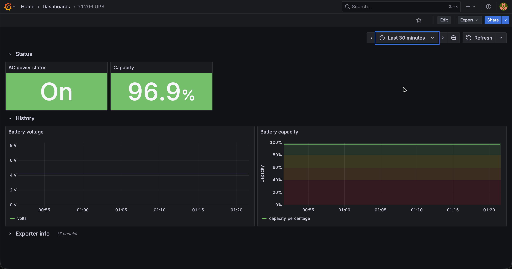

# X1206-docker-nodejs-rpi5-monitor

Recently I bought [Suptronics X1206 V1.1 UPS board](https://suptronics.com/Raspberrypi/Power_mgmt/x1206-v1.1.html)
and put together simple Prometheus exporter for it (based on [original python scripts](https://github.com/suptronics/x120x))
so I can monitor it with Grafana (dashboard is [here](https://grafana.com/grafana/dashboards/24523-x1206-ups/)).

<p align="center">
    
</p>

## Status

[](https://github.com/simonjur/x1206-docker-nodejs-rpi5-monitor/actions/workflows/ci-checks.yml)
[](https://github.com/simonjur/x1206-docker-nodejs-rpi5-monitor/actions/workflows/build-image.yml)

[](https://sonarcloud.io/summary/new_code?id=simonjur_x1206-docker-nodejs-rpi5-monitor)

| Platform                             | Tested |
| ------------------------------------ | ------ |
| Raspberry Pi 5, Debian 12 (bookworm) | ✅     |
| Raspberry Pi 5, Debian 13 (trixie)   | ❓     |

## Running through composer

This is how I run it on my Raspberry pi 5:

> [!INFO]
> Prebuilt for arm/x64 https://github.com/simonjur/x1206-docker-nodejs-rpi5-monitor/pkgs/container/x1206-docker-nodejs-rpi5-monitor%2Fx1206-nodejs-exporter on ghcr.io
>
> ```bash
> docker pull ghcr.io/simonjur/x1206-docker-nodejs-rpi5-monitor/x1206-nodejs-exporter:latest
> ```

```bash
git clone git@github.com:simonjur/x1206-docker-nodejs-rpi5-monitor.git
cd x1206-docker-nodejs-rpi5-monitor
docker compose up -d
```

## Development

### Building the image manually

local image build using docker buildx:

```bash
docker buildx build -t x1206 .
```

or with docker compose:

```bash
docker compose build
```

### Running in docker

local docker run:

```bash
docker run --rm  --privileged   --device /dev/i2c-1:/dev/i2c-1   --device /dev/gpiochip0:/dev/gpiochip0   -v /var/run:/var/run  docker.io/library/x1206
```

local docker compose:

```bash
docker compose up -d
```

### Running locally without docker

Install dependencies:

> [!WARNING]
> Package `node-libgpiod` compiles native code and requires
> some OS packages to be installed first.
> See [Dockerfile](./Dockerfile) for details.

```bash
npm install
```

Simple status check:

```bash
node --run status
```

should print something like:

```bash
┌────────────────┬───────┐
│         Metric │ Value │
├────────────────┼───────┤
│   Capacity (%) │ 96.87 │
│    Voltage (V) │ 4.161 │
│ AC Power State │    On │
│ Battery status │  Full │
└────────────────┴───────┘
```
